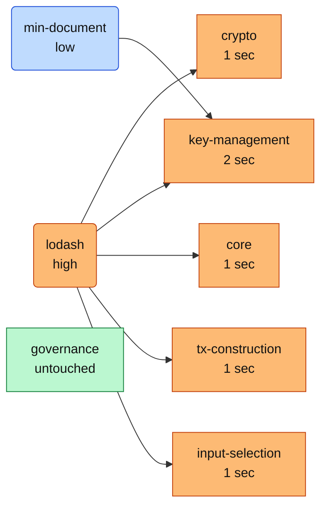
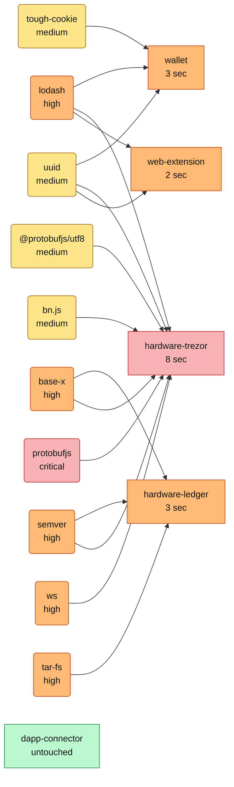
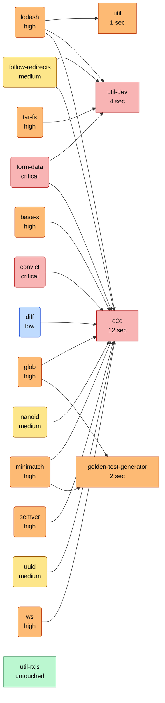
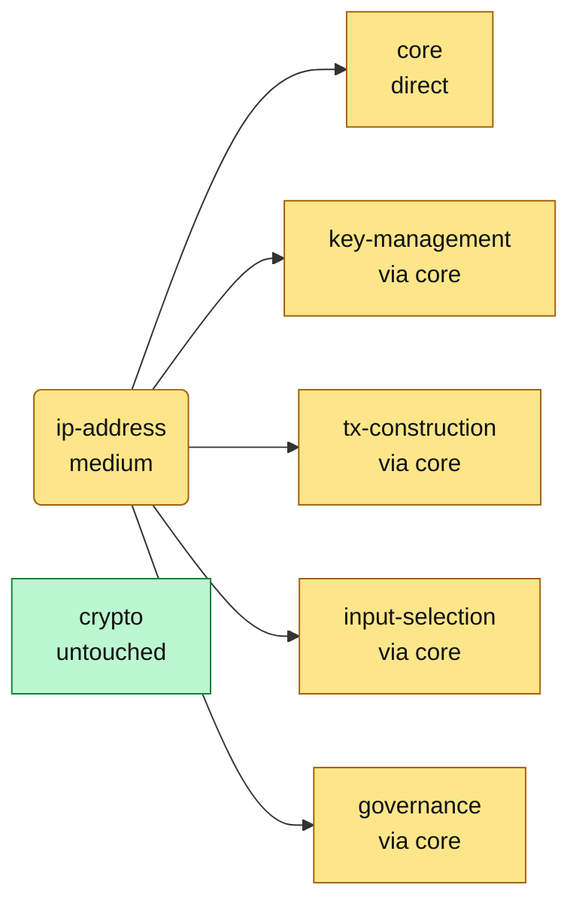
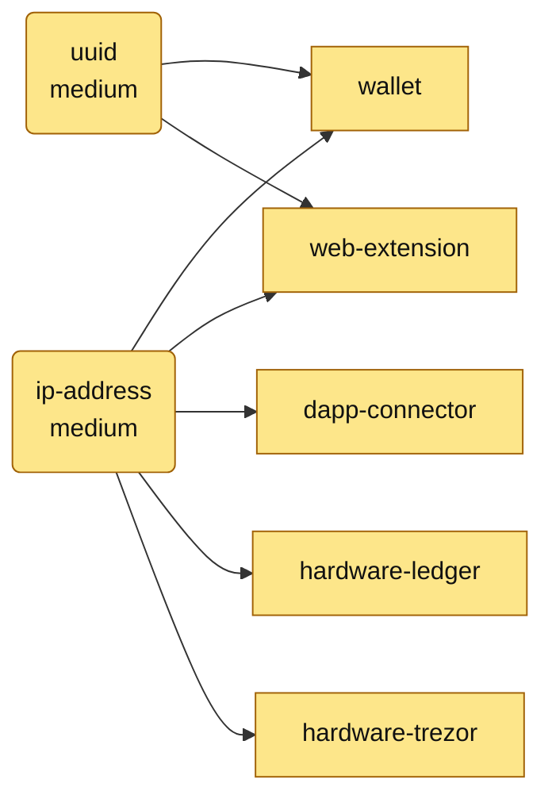
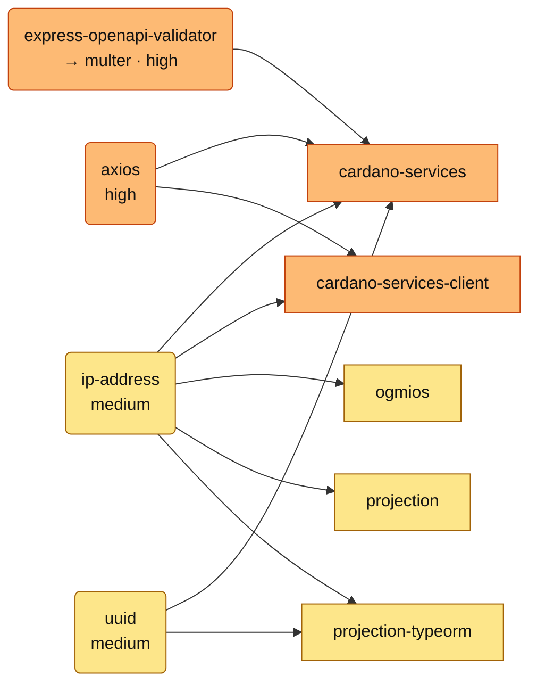
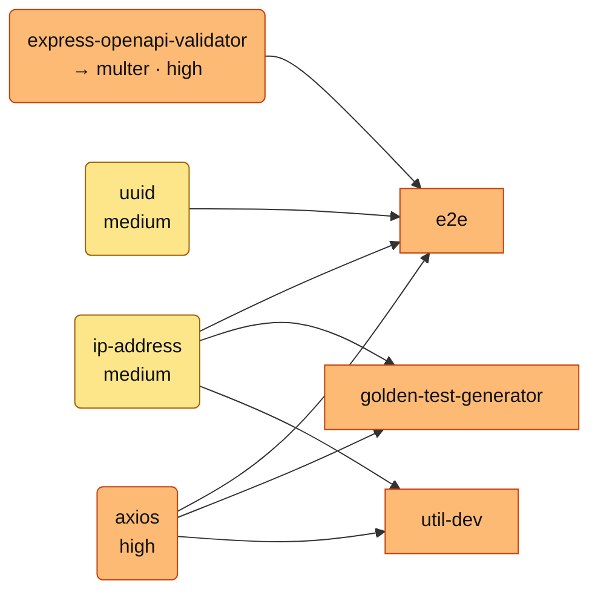

# Dependency Vulnerability Audit

**Date:** 2026-06-19 · **Baseline:** `master` · **Scope:** repository-wide dependency tree

A point-in-time audit of the dependency changes made to remediate Dependabot vulnerability alerts. This is **not** a code-level security review of the SDK itself — for that, see the [crypto package audit](../../packages/crypto/AUDIT.md).

Analysis of **every dependency whose resolved version changed** in this remediation (direct and transitive), computed by diffing `yarn.lock` against the `master` baseline. Sources: GitHub/npm advisory DB (`yarn npm audit` + Dependabot), npm registry (license, maintainers, deprecation), and the local production dependency closure of the published `@cardano-sdk/*` packages.

## Summary

- **Packages updated:** 130 — 43 security-relevant, 87 incidental transitive shifts pulled along by in-range relocks.
- **Alert outcomes:** 27 CLOSED · 16 PARTIAL (patched copy resolved; an older pinned copy remains, tracked in a follow-up issue) · 0 OPEN.
- **Consumer-facing (reach a published package's production closure):** 73 · dev/build-only: 57.
- **Provenance/license flags:** 1 — @types/eslint-scope (DEPRECATED).
- **Supply chain:** 100% of installed packages carry verified npm registry signatures; 36 updated packages ship SLSA build provenance (33 newly adopted it); 25 reflect known maintainer/governance transitions (detailed below).
- **Licenses present:** 0BSD, Apache-2.0, BSD-2-Clause, BSD-3-Clause, BlueOak-1.0.0, CC-BY-4.0, ISC, MIT — all permissive; no copyleft obligations introduced.

> Maintainer counts are *informational*: a count of 1 is common (the npm org owner) and is not a risk flag on its own. Only deprecation and non-permissive/unknown licenses are flagged.

Legend — **Status**: CLOSED = no vulnerable version remains · PARTIAL = patched copy resolved, older pinned copy still present · OPEN = still vulnerable. **Scope**: direct|transitive · prod|dev-only · consumer = reachable in a published package's production closure.

## Blast Radius — impacted SDK packages

Which published SDK packages have their dependency tree altered by this change, split by **production** closure (what a consumer installs) vs **dev/build-only**, and weighted by **package sensitivity**.

**Sensitivity tiers** (reviewer-adjustable): **Tier 1** handles key material, cryptography, consensus and transaction construction; **Tier 2** orchestrates wallets, hardware signing and the dApp/extension surface; **Tier 3** is backend services and data plane; **Tier 4** is utilities and dev/test tooling.

One **dependency tree per tier**. Each updated, security-relevant dependency (left, coloured by advisory severity — 🔴 critical · 🟠 high · 🟡 medium · 🔵 low) edges to the tier packages that pull it into **production**; package nodes are coloured by the worst severity reaching them (🟢 = untouched). **Node colour reflects the severity of the dependency that changed — not residual risk; almost all of these changes are CLOSED in this PR (see §A).** Fan-out = blast radius.

#### 🔑 Tier 1 — Keys, crypto, consensus & transaction logic — highest-impact on regression

*5 of 6 packages take a security-relevant production dependency change.*

#### 🛡️ Tier 2 — Wallet orchestration, hardware signing, dApp/extension surface

*4 of 5 packages take a security-relevant production dependency change.*

#### 🌐 Tier 3 — Backend services & data plane

*5 of 5 packages take a security-relevant production dependency change.*

```mermaid
flowchart LR
  classDef crit fill:#f8b4b4,stroke:#b91c1c,color:#111;
  classDef high fill:#fdba74,stroke:#c2410c,color:#111;
  classDef med  fill:#fde68a,stroke:#a16207,color:#111;
  classDef low  fill:#bfdbfe,stroke:#1d4ed8,color:#111;
  classDef none fill:#bbf7d0,stroke:#15803d,color:#111;

  d_lodash("lodash<br/>high"):::high
  d_ws("ws<br/>high"):::high
  d_follow_redirects("follow-redirects<br/>medium"):::med
  d_form_data("form-data<br/>critical"):::crit
  d_picomatch("picomatch<br/>medium"):::med
  d_uuid("uuid<br/>medium"):::med
  d_body_parser("body-parser<br/>high"):::high
  d_cookie("cookie<br/>low"):::low
  d_cross_spawn("cross-spawn<br/>high"):::high
  d_express("express<br/>low"):::low
  d_fast_uri("fast-uri<br/>high"):::high
  d_glob("glob<br/>high"):::high
  d_js_yaml("js-yaml<br/>medium"):::med
  d_minimatch("minimatch<br/>high"):::high
  d_nanoid("nanoid<br/>medium"):::med
  d_path_to_regexp("path-to-regexp<br/>high"):::high
  d_qs("qs<br/>medium"):::med
  d_send("send<br/>low"):::low
  d_serve_static("serve-static<br/>low"):::low
  d_validator("validator<br/>high"):::high

  p_cardano_services["cardano-services<br/>17 sec"]:::crit
  p_cardano_services_client["cardano-services-client<br/>5 sec"]:::crit
  p_ogmios["ogmios<br/>3 sec"]:::high
  p_projection["projection<br/>2 sec"]:::high
  p_projection_typeorm["projection-typeorm<br/>3 sec"]:::high

  d_lodash --> p_cardano_services
  d_lodash --> p_cardano_services_client
  d_lodash --> p_ogmios
  d_lodash --> p_projection
  d_lodash --> p_projection_typeorm
  d_ws --> p_cardano_services
  d_ws --> p_cardano_services_client
  d_ws --> p_ogmios
  d_follow_redirects --> p_cardano_services
  d_follow_redirects --> p_cardano_services_client
  d_form_data --> p_cardano_services
  d_form_data --> p_cardano_services_client
  d_picomatch --> p_projection
  d_picomatch --> p_projection_typeorm
  d_uuid --> p_cardano_services
  d_uuid --> p_projection_typeorm
  d_body_parser --> p_cardano_services
  d_cookie --> p_cardano_services
  d_cross_spawn --> p_cardano_services
  d_express --> p_cardano_services
  d_fast_uri --> p_cardano_services
  d_glob --> p_cardano_services
  d_js_yaml --> p_cardano_services
  d_minimatch --> p_cardano_services
  d_nanoid --> p_ogmios
  d_path_to_regexp --> p_cardano_services
  d_qs --> p_cardano_services
  d_send --> p_cardano_services
  d_serve_static --> p_cardano_services
  d_validator --> p_cardano_services_client
```

#### 🧰 Tier 4 — Utilities & dev/test tooling (mostly not consumer-installed)

*4 of 5 packages take a security-relevant production dependency change.*

### Per-package detail

| Package | Sensitivity | Prod deps Δ | of which security | Max prod severity | Dev-only deps Δ | Published |
|---|---|--:|--:|---|--:|:--:|
| `key-management` | Tier 1 | 4 | 2 | 🟠 high | 48 | yes |
| `crypto` | Tier 1 | 2 | 1 | 🟠 high | 48 | yes |
| `tx-construction` | Tier 1 | 2 | 1 | 🟠 high | 49 | yes |
| `core` | Tier 1 | 1 | 1 | 🟠 high | 49 | yes |
| `input-selection` | Tier 1 | 1 | 1 | 🟠 high | 49 | yes |
| `governance` | Tier 1 | 0 | 0 | 🟢 none | 49 | yes |
| `hardware-trezor` | Tier 2 | 29 | 8 | 🔴 critical | 31 | yes |
| `hardware-ledger` | Tier 2 | 4 | 3 | 🟠 high | 48 | yes |
| `wallet` | Tier 2 | 4 | 3 | 🟠 high | 60 | yes |
| `web-extension` | Tier 2 | 3 | 2 | 🟠 high | 49 | yes |
| `dapp-connector` | Tier 2 | 0 | 0 | 🟢 none | 58 | yes |
| `cardano-services` | Tier 3 | 39 | 17 | 🔴 critical | 44 | yes |
| `cardano-services-client` | Tier 3 | 8 | 5 | 🔴 critical | 68 | yes |
| `projection-typeorm` | Tier 3 | 5 | 3 | 🟠 high | 48 | yes |
| `ogmios` | Tier 3 | 4 | 3 | 🟠 high | 48 | yes |
| `projection` | Tier 3 | 3 | 2 | 🟠 high | 48 | yes |
| `e2e` | Tier 4 | 22 | 12 | 🔴 critical | 76 | yes |
| `util-dev` | Tier 4 | 7 | 4 | 🔴 critical | 48 | yes |
| `golden-test-generator` | Tier 4 | 5 | 2 | 🟠 high | 46 | yes |
| `util` | Tier 4 | 1 | 1 | 🟠 high | 49 | yes |
| `util-rxjs` | Tier 4 | 1 | 0 | 🟢 none | 49 | yes |

### Reading the blast radius

- **Tier 1's only production security-relevant change is `lodash`** (4.17.21 → 4.18.1, **CLOSED** in this PR) — across `core`, `crypto`, `key-management`, `tx-construction`, `input-selection`; `governance` is untouched. No *remaining* Tier-1 production exposure except the unfixable `lodash` advisory class, which upstream has now patched and we have taken. The code that derives keys, signs, builds and validates transactions takes only this one validated patch-level bump (build + core 992/992, crypto 76/76, util 126/126).
- **The radius concentrates in Tier 3 + hardware.** `cardano-services` (Express/HTTP stack), `cardano-services-client`/`util-dev` (HTTP client: `form-data`/`follow-redirects`/`ws`), and `hardware-trezor` (`protobufjs`, `bn.js`, `base-x`) absorb most of the change. Validated by `yarn build` (all workspaces) + targeted suites.
- **Most Tier 4 impact is dev/test-only** (`e2e`, `golden-test-generator`, `util-dev`) and never reaches a consumer install.
- **Every production change is a patch/minor in-range relock** except the single `protobufjs` resolution; no major versions ship here (those are deferred — #1701–#1708).

## Supply-chain provenance & publisher continuity

Deep checks on the dependencies this change introduces — registry-signature verification, SLSA build provenance, and **publisher continuity** (did the npm account that publishes a package change between the version on `master` and the version pulled here — the primary account-takeover signal).

### Integrity baseline

- **Registry signatures:** `npm audit signatures` verifies **2728 / 2728** installed packages have a valid npm registry signature — nothing is unsigned or tampered in transit.
- **Build provenance (SLSA):** **36** of the 118 updated packages ship a verifiable SLSA provenance attestation on the new version, all published via GitHub Actions **OIDC** (36 packages publish via CI/OIDC). These have a cryptographic link from the published artifact back to the source commit + build.
- **Provenance adoption:** **33** packages *newly adopted* CI/OIDC + provenance publishing between the `master` version and the version here — a supply-chain posture **improvement** introduced by this update.

Packages shipping SLSA provenance on the updated version:

> `@babel/code-frame`, `@babel/compat-data`, `@babel/core`, `@babel/generator`, `@babel/helper-compilation-targets`, `@babel/helper-globals`, `@babel/helper-module-imports`, `@babel/helper-module-transforms`, `@babel/helper-plugin-utils`, `@babel/helper-string-parser`, `@babel/helper-validator-identifier`, `@babel/helper-validator-option`, `@babel/helpers`, `@babel/parser`, `@babel/plugin-transform-modules-systemjs`, `@babel/template`, `@babel/traverse`, `@babel/types`, `@tootallnate/once`, `baseline-browser-mapping`, `caniuse-lite`, `dayjs`, `electron-to-chromium`, `enhanced-resolve`, `node-releases`, `protobufjs`, `semver`, `socket.io-parser`, `tapable`, `terser-webpack-plugin`, `typeorm`, `uuid`, `validator`, `watchpack`, `webpack`, `webpack-sources`

### Publisher continuity — human account changes (25)

These updated packages are now published by a **different human account** than the version on `master`. None are anonymous/new-account single-version hijacks; each maps to an established maintainer or a documented project-governance transition. Listed for independent reviewer confirmation.

| Package | Publisher on `master` | Publisher here | Assessment (confirm) |
|---|---|---|---|
| `@sideway/address` | hueniverse | marsup | hapi.js org — `marsup` is the current hapi lead |
| `base-x` | junderw | fanatid | bitcoinjs ecosystem maintainer (`fanatid`) |
| `body-parser` | ulisesgascon | jonchurch | jshttp / Express-TC — both accounts are Express/jshttp org maintainers |
| `convert-source-map` | thlorenz | phated | `phated` (gulp/JS tooling maintainer) |
| `convict` | madarche | clouserw | Mozilla `convict` maintainer (`clouserw`) |
| `dedent` | dmnd | joshuakgoldberg | documented hand-off to `joshuakgoldberg` |
| `diff` | kpdecker | explodingcabbage | current `jsdiff` maintainer (`explodingcabbage`) |
| `encodeurl` | dougwilson | blakeembrey | jshttp / Express-TC — both accounts are Express/jshttp org maintainers |
| `finalhandler` | wesleytodd | ulisesgascon | jshttp / Express-TC — both accounts are Express/jshttp org maintainers |
| `handlebars` | knappi | jaylinski | handlebars.js maintainer (`jaylinski`) |
| `http-errors` | dougwilson | ulisesgascon | jshttp / Express-TC — both accounts are Express/jshttp org maintainers |
| `jwa` | omsmith | panva | `panva` — well-known JOSE/JWT maintainer |
| `jws` | omsmith | julien.wollscheid | node-jws maintainer (`julien.wollscheid`) |
| `loader-runner` | sokra | evilebottnawi | webpack core maintainer (`evilebottnawi`) |
| `lodash` | bnjmnt4n | jdalton | lodash maintainers — `jdalton` is the original author; `4.18.1` corrects the deprecated `4.18.0` |
| `merge-descriptors` | dougwilson | sindresorhus | jshttp / Express-TC — both accounts are Express/jshttp org maintainers |
| `mime-db` | dougwilson | wesleytodd | jshttp / Express-TC — both accounts are Express/jshttp org maintainers |
| `parse5` | inikulin | feedic | current parse5 maintainer (`feedic`) |
| `parse5-htmlparser2-tree-adapter` | inikulin | feedic | current parse5 maintainer (`feedic`) |
| `picomatch` | mrmlnc | danez | established maintainer (`danez`) |
| `raw-body` | dougwilson | bsebas | jshttp / Express-TC — both accounts are Express/jshttp org maintainers |
| `serve-static` | wesleytodd | ulisesgascon | jshttp / Express-TC — both accounts are Express/jshttp org maintainers |
| `statuses` | dougwilson | ulisesgascon | jshttp / Express-TC — both accounts are Express/jshttp org maintainers |
| `tough-cookie` | awaterma | ccasey | Salesforce tough-cookie maintainer (`ccasey`) |
| `yargs` | oss-bot | shadowspawn | yargs maintainer (`shadowspawn`) |

> The 9 `jshttp` packages (`body-parser`, `http-errors`, `serve-static`, `finalhandler`, `statuses`, `raw-body`, `mime-db`, `encodeurl`, `merge-descriptors`) are maintained under the jshttp / Express Technical Committee (following the documented 2024 hand-off from `dougwilson`) — a single, well-known ecosystem event, not 9 independent changes.

### Cross-referenced databases

Findings are not from a single source. The advisory data combines the **GitHub Advisory Database** (Dependabot) and **`npm audit` / `npm audit signatures`**, cross-referenced against:

- **OSV.dev** (aggregates GHSA, the npm registry, GitLab and more) — corroborates and in places broadens coverage. For example OSV returns **31** records for `vm2@3.9.18`, more than Dependabot surfaced, reinforcing the decision to *eliminate* vm2 rather than pin it.
- **CISA KEV** (Known Exploited Vulnerabilities) — **0 of the 213 open CVEs across all severities appear in the KEV catalogue**, i.e. none are known to be actively exploited in the wild. This materially de-risks the deferred items (#1701–#1708).
- **NVD** (CVE/CVSS authority) — consulted for CVSS scores where reachable (its API is rate-limited).

### Limitations

- Publisher continuity compares the **latest** old vs new version; it detects *that* the publishing identity changed, not precisely *when*. A change may predate this bump.
- Signature + provenance verification proves artifact integrity and (where present) build origin; it cannot by itself prove a maintainer account was not compromised. Combined with 100% signature coverage and the absence of anonymous-account or single-version-hijack patterns, residual supply-chain risk from this update is assessed **low**.

## A. Security-relevant updates (43)

| Package | Version (master → updated) | Status (severity) | Scope | License | Maint / latest |
|---|---|---|---|---|---|
| `@babel/core` | 7.19.6 → **7.29.7** | CLOSED (low) | direct · dev-only · consumer:no | MIT | 4 / 8.0.1 |
| `@babel/plugin-transform-modules-systemjs` | 7.19.6 → **7.29.7** | CLOSED (high) | transitive · dev-only · consumer:no | MIT | 4 / 8.0.1 |
| `@protobufjs/utf8` | 1.1.0 → **1.1.1** | CLOSED (medium) | transitive · prod · consumer:yes | BSD-3-Clause | 3 / 1.1.1 |
| `basic-ftp` | 5.0.5 → **5.3.1** | CLOSED (high/critical) | transitive · dev-only · consumer:no | MIT | 1 / 6.0.1 |
| `bn.js` | 4.12.0, 5.2.1 → **4.12.3, 5.2.3** | CLOSED (medium) | transitive · prod · consumer:yes | MIT | 4 / 5.2.3 |
| `body-parser` | 1.20.2, 1.20.3 → **1.20.5** | CLOSED (high) | direct · prod · consumer:yes | MIT | 4 / 2.3.0 |
| `convict` | 6.2.4 → **6.2.5** | CLOSED (critical) | direct · prod · consumer:yes | Apache-2.0 | 6 / 6.2.5 |
| `express` | 4.19.2, 4.21.2 → **4.22.2** | CLOSED (low) | direct · prod · consumer:yes | MIT | 5 / 5.2.1 |
| `fast-uri` | 3.0.3 → **3.1.2** | CLOSED (high) | transitive · prod · consumer:yes | BSD-3-Clause | 11 / 4.0.0 |
| `flatted` | 3.2.7 → **3.4.2** | CLOSED (high) | transitive · dev-only · consumer:no | ISC | 1 / 3.4.2 |
| `follow-redirects` | 1.15.6 → **1.16.0** | CLOSED (medium) | transitive · prod · consumer:yes | MIT | 2 / 1.16.0 |
| `glob` | 10.2.2, 11.0.0, 6.0.4, 7.1.7, 7.2.0, 7.2.3, 8.1.0, 9.3.5 → **10.5.0, 11.1.0, 6.0.4, 7.1.7, 7.2.0, 7.2.3, 8.1.0, 9.3.5** | CLOSED (high) | transitive · prod · consumer:yes | ISC | 1 / 13.0.6 |
| `handlebars` | 4.7.7 → **4.7.9** | CLOSED (low/medium/high/critical) | transitive · dev-only · consumer:no | MIT | 6 / 4.7.9 |
| `joi` | 17.6.4 → **17.13.4** | CLOSED (medium) | transitive · dev-only · consumer:no | BSD-3-Clause | 6 / 18.2.3 |
| `jws` | 3.2.2 → **3.2.3** | CLOSED (high) | transitive · dev-only · consumer:no | MIT | 4 / 4.0.1 |
| `lodash` | 4.17.21 → **4.18.1** | CLOSED (high/medium) | direct · prod · consumer:yes | MIT | 3 / 4.18.1 |
| `min-document` | 2.19.0 → **2.19.2** | CLOSED (low) | transitive · prod · consumer:yes | MIT | 2 / 2.19.2 |
| `path-to-regexp` | 0.1.12, 0.1.7, 6.2.1 → **0.1.13, 6.3.0** | CLOSED (high) | transitive · prod · consumer:yes | MIT | 6 / 8.4.2 |
| `picomatch` | 2.3.1 → **2.3.2** | CLOSED (medium) | transitive · prod · consumer:yes | MIT | 4 / 4.0.4 |
| `protobufjs` | 7.2.6 → **7.6.4** | CLOSED (high/medium/critical) | transitive · prod · consumer:yes | BSD-3-Clause | 3 / 8.6.4 |
| `send` | 0.18.0, 0.19.0 → **0.19.2** | CLOSED (low) | transitive · prod · consumer:yes | MIT | 4 / 1.2.1 |
| `serve-static` | 1.15.0, 1.16.2 → **1.16.3** | CLOSED (low) | transitive · prod · consumer:yes | MIT | 3 / 2.2.1 |
| `shell-quote` | 1.7.4 → **1.8.4** | CLOSED (critical) | transitive · dev-only · consumer:no | MIT | 4 / 1.8.4 |
| `socket.io-parser` | 4.2.3 → **4.2.6** | CLOSED (high) | transitive · dev-only · consumer:no | MIT | 2 / 4.2.6 |
| `typeorm` | 0.3.17 → **0.3.30** | CLOSED (high) | direct · dev-only · consumer:no | MIT | 2 / 1.0.0 |
| `validator` | 13.7.0 → **13.15.35** | CLOSED (high/medium) | transitive · prod · consumer:yes | MIT | 3 / 13.15.35 |
| `webpack` | 5.101.3 → **5.107.2** | CLOSED (low) | direct · dev-only · consumer:no | MIT | 8 / 5.107.2 |
| `@tootallnate/once` | 1.1.2, 2.0.0 → **1.1.2, 2.0.1** | PARTIAL (low) | transitive · dev-only · consumer:no | MIT | 1 / 3.0.1 |
| `base-x` | 3.0.9, 4.0.0 → **3.0.11, 3.0.9, 4.0.1** | PARTIAL (high) | transitive · prod · consumer:yes | MIT | 3 / 5.0.1 |
| `cookie` | 0.4.1, 0.6.0, 0.7.1 → **0.4.1, 0.7.2** | PARTIAL (low) | transitive · prod · consumer:yes | MIT | 3 / 1.1.1 |
| `cross-spawn` | 4.0.2, 6.0.5, 7.0.3 → **4.0.2, 6.0.6, 7.0.6** | PARTIAL (high) | transitive · prod · consumer:yes | MIT | 1 / 7.0.6 |
| `diff` | 4.0.2, 5.0.0, 5.1.0 → **4.0.4, 5.0.0, 5.2.2** | PARTIAL (low) | transitive · prod · consumer:yes | BSD-3-Clause | 2 / 9.0.0 |
| `form-data` | 2.3.3, 3.0.1, 4.0.0, 4.0.4 → **2.3.3, 3.0.5, 4.0.6** | PARTIAL (high/critical) | transitive · prod · consumer:yes | MIT | 6 / 4.0.6 |
| `js-yaml` | 3.14.1, 4.1.0 → **3.14.2, 4.1.0, 4.2.0** | PARTIAL (medium) | transitive · prod · consumer:yes | MIT | 1 / 4.2.0 |
| `minimatch` | 10.0.1, 3.0.8, 3.1.2, 5.0.1, 5.1.6, 7.4.6, 8.0.4, 9.0.0 → **10.2.5, 3.0.8, 3.1.5, 5.0.1, 5.1.9, 7.4.9, 8.0.7, 9.0.9** | PARTIAL (high) | transitive · prod · consumer:yes | ISC | 1 / 10.2.5 |
| `nanoid` | 3.3.3, 3.3.4 → **3.3.13, 3.3.3** | PARTIAL (medium) | direct · prod · consumer:yes | MIT | 1 / 5.1.14 |
| `postcss` | 7.0.39, 8.4.19 → **7.0.39, 8.5.15** | PARTIAL (medium) | transitive · dev-only · consumer:no | MIT | 1 / 8.5.15 |
| `qs` | 6.11.0, 6.11.2, 6.13.0, 6.5.3 → **6.15.2, 6.5.5** | PARTIAL (medium/low) | transitive · prod · consumer:yes | BSD-3-Clause | 2 / 6.15.2 |
| `semver` | 5.5.0, 5.7.2, 6.3.1, 7.3.5, 7.5.4, 7.7.2 → **5.5.0, 5.7.2, 6.3.1, 7.3.5, 7.8.4** | PARTIAL (high) | transitive · prod · consumer:yes | ISC | 4 / 7.8.4 |
| `tar-fs` | 2.0.1, 2.1.1 → **2.0.1, 2.1.1, 2.1.4** | PARTIAL (high) | transitive · prod · consumer:yes | MIT | 2 / 3.1.2 |
| `tough-cookie` | 2.5.0, 4.1.2 → **2.5.0, 4.1.4** | PARTIAL (medium) | transitive · prod · consumer:yes | BSD-3-Clause | 2 / 6.0.1 |
| `uuid` | 10.0.0, 3.4.0, 8.0.0, 8.3.2, 9.0.0 → **10.0.0, 11.1.1, 3.4.0, 8.0.0, 8.3.2, 9.0.0** | PARTIAL (medium) | direct · prod · consumer:yes | MIT | 2 / 14.0.0 |
| `ws` | 5.2.4, 7.5.10, 8.18.3, 8.2.3, 8.5.0 → **5.2.5, 7.5.11, 8.2.3, 8.21.0, 8.5.0** | PARTIAL (high/medium) | direct · prod · consumer:yes | MIT | 4 / 8.21.0 |

## B. Incidental transitive updates — no known advisory (87)

Moved only because an in-range relock re-resolved a shared sub-tree. Listed for completeness with license + provenance.

| Package | Version (master → updated) | Scope | License | Maint / latest |
|---|---|---|---|---|
| `@ampproject/remapping` | 2.2.0 → _removed_ | transitive · dev-only · consumer:no | Apache-2.0 | 2 / 2.3.0 |
| `@babel/code-frame` | 7.12.11, 7.24.7 → 7.12.11, 7.24.7, 7.29.7 | transitive · prod · consumer:yes | MIT | 4 / 8.0.0 |
| `@babel/compat-data` | 7.20.0 → 7.20.0, 7.29.7 | transitive · dev-only · consumer:no | MIT | 4 / 8.0.0 |
| `@babel/generator` | 7.18.2, 7.25.6 → 7.18.2, 7.25.6, 7.29.7 | transitive · prod · consumer:yes | MIT | 4 / 8.0.0 |
| `@babel/helper-compilation-targets` | 7.20.0 → 7.20.0, 7.29.7 | transitive · dev-only · consumer:no | MIT | 4 / 8.0.0 |
| `@babel/helper-globals` | _new_ → 7.29.7 | transitive · dev-only · consumer:no | MIT | 4 / 8.0.0 |
| `@babel/helper-hoist-variables` | 7.22.5 → _removed_ | transitive · dev-only · consumer:no | MIT | 4 / 7.24.7 |
| `@babel/helper-module-imports` | 7.24.7 → 7.24.7, 7.29.7 | transitive · prod · consumer:yes | MIT | 4 / 8.0.0 |
| `@babel/helper-module-transforms` | 7.25.2 → 7.25.2, 7.29.7 | transitive · prod · consumer:yes | MIT | 4 / 8.0.1 |
| `@babel/helper-plugin-utils` | 7.24.8 → 7.24.8, 7.29.7 | transitive · prod · consumer:yes | MIT | 4 / 8.0.1 |
| `@babel/helper-string-parser` | 7.24.8 → 7.24.8, 7.29.7 | transitive · prod · consumer:yes | MIT | 4 / 8.0.0 |
| `@babel/helper-validator-identifier` | 7.24.7 → 7.24.7, 7.29.7 | transitive · prod · consumer:yes | MIT | 4 / 8.0.2 |
| `@babel/helper-validator-option` | 7.24.8 → 7.24.8, 7.29.7 | transitive · prod · consumer:yes | MIT | 4 / 8.0.0 |
| `@babel/helpers` | 7.20.0 → 7.29.7 | transitive · dev-only · consumer:no | MIT | 4 / 8.0.0 |
| `@babel/parser` | 7.18.4, 7.25.6 → 7.18.4, 7.25.6, 7.29.7 | transitive · prod · consumer:yes | MIT | 4 / 8.0.0 |
| `@babel/template` | 7.25.0 → 7.25.0, 7.29.7 | transitive · prod · consumer:yes | MIT | 4 / 8.0.0 |
| `@babel/traverse` | 7.25.6 → 7.25.6, 7.29.7 | transitive · prod · consumer:yes | MIT | 4 / 8.0.0 |
| `@babel/types` | 7.19.0, 7.25.6 → 7.19.0, 7.25.6, 7.29.7 | transitive · prod · consumer:yes | MIT | 4 / 8.0.0 |
| `@isaacs/cliui` | 8.0.2 → 8.0.2, 9.0.0 | transitive · prod · consumer:yes | BlueOak-1.0.0 | 1 / 9.0.0 |
| `@jridgewell/gen-mapping` | 0.1.1, 0.3.5 → 0.3.13, 0.3.5 | transitive · prod · consumer:yes | MIT | 1 / 0.3.13 |
| `@jridgewell/remapping` | _new_ → 2.3.5 | transitive · dev-only · consumer:no | MIT | 1 / 2.3.5 |
| `@jridgewell/sourcemap-codec` | 1.4.15 → 1.4.15, 1.5.5 | transitive · prod · consumer:yes | MIT | 1 / 1.5.5 |
| `@jridgewell/trace-mapping` | 0.3.25, 0.3.9 → 0.3.25, 0.3.31, 0.3.9 | transitive · prod · consumer:yes | MIT | 1 / 0.3.31 |
| `@protobufjs/codegen` | 2.0.4 → 2.0.5 | transitive · prod · consumer:yes | BSD-3-Clause | 3 / 2.0.5 |
| `@protobufjs/eventemitter` | 1.1.0 → 1.1.1 | transitive · prod · consumer:yes | BSD-3-Clause | 3 / 1.1.1 |
| `@protobufjs/fetch` | 1.1.0 → 1.1.1 | transitive · prod · consumer:yes | BSD-3-Clause | 3 / 1.1.1 |
| `@protobufjs/inquire` | 1.1.0 → _removed_ | transitive · dev-only · consumer:no | BSD-3-Clause | 3 / 1.1.2 |
| `@sideway/address` | 4.1.4 → 4.1.5 | transitive · dev-only · consumer:no | BSD-3-Clause | 1 / 5.0.0 |
| `@types/eslint` | 8.4.9 → _removed_ | transitive · dev-only · consumer:no | MIT | 1 / 9.6.1 |
| `@types/eslint-scope` | 3.7.7 → _removed_ | transitive · dev-only · consumer:no | MIT | 1 / 9.1.0 ⚠ DEPRECATED |
| `@types/estree` | 1.0.0, 1.0.8 → 1.0.8 | transitive · dev-only · consumer:no | MIT | 1 / 1.0.9 |
| `acorn` | 4.0.13, 7.4.1, 8.10.0, 8.15.0 → 4.0.13, 7.4.1, 8.10.0, 8.15.0, 8.17.0 | transitive · prod · consumer:yes | MIT | 3 / 8.17.0 |
| `ansis` | _new_ → 4.3.1 | transitive · dev-only · consumer:no | ISC | 1 / 4.3.1 |
| `any-promise` | 1.3.0 → _removed_ | transitive · dev-only · consumer:no | MIT | 1 / 1.3.0 |
| `balanced-match` | 1.0.2 → 1.0.2, 4.0.4 | transitive · prod · consumer:yes | MIT | 1 / 4.0.4 |
| `baseline-browser-mapping` | _new_ → 2.10.38 | transitive · dev-only · consumer:no | Apache-2.0 | 1 / 2.10.38 |
| `brace-expansion` | 1.1.11, 2.0.1 → 1.1.11, 2.0.1, 2.1.1, 5.0.6 | transitive · prod · consumer:yes | MIT | 2 / 5.0.6 |
| `browserslist` | 4.21.4, 4.25.4 → 4.21.4, 4.25.4, 4.28.2 | transitive · dev-only · consumer:no | MIT | 1 / 4.28.2 |
| `caniuse-lite` | 1.0.30001427, 1.0.30001741 → 1.0.30001427, 1.0.30001741, 1.0.30001799 | transitive · dev-only · consumer:no | CC-BY-4.0 | 1 / 1.0.30001799 |
| `cli-highlight` | 2.1.11 → _removed_ | transitive · dev-only · consumer:no | ISC | 1 / 2.1.11 |
| `convert-source-map` | 1.9.0 → 1.9.0, 2.0.0 | transitive · dev-only · consumer:no | MIT | 2 / 2.0.0 |
| `cookie-signature` | 1.0.6 → 1.0.6, 1.0.7 | transitive · prod · consumer:yes | MIT | 3 / 1.2.2 |
| `date-fns` | 2.30.0 → _removed_ | transitive · dev-only · consumer:no | MIT | 1 / 4.4.0 |
| `dayjs` | _new_ → 1.11.21 | transitive · dev-only · consumer:no | MIT | 1 / 1.11.21 |
| `dedent` | 0.7.0 → 0.7.0, 1.7.2 | transitive · dev-only · consumer:no | MIT | 2 / 1.7.2 |
| `dotenv` | 10.0.0, 16.0.1, 16.0.3 → 10.0.0, 16.0.1, 16.0.3, 16.6.1 | direct · prod · consumer:yes | BSD-2-Clause | 3 / 17.4.2 |
| `electron-to-chromium` | 1.4.284, 1.5.215 → 1.4.284, 1.5.215, 1.5.376 | transitive · dev-only · consumer:no | ISC | 1 / 1.5.376 |
| `encodeurl` | 1.0.2, 2.0.0 → 2.0.0 | transitive · prod · consumer:yes | MIT | 2 / 2.0.0 |
| `enhanced-resolve` | 4.5.0, 5.12.0, 5.18.3 → 4.5.0, 5.12.0, 5.24.0 | transitive · dev-only · consumer:no | MIT | 8 / 5.24.0 |
| `es-module-lexer` | 1.7.0 → 2.1.0 | transitive · dev-only · consumer:no | MIT | 1 / 2.1.0 |
| `finalhandler` | 1.2.0, 1.3.1 → 1.3.2 | transitive · prod · consumer:yes | MIT | 3 / 2.1.1 |
| `foreground-child` | 3.1.1 → 3.1.1, 3.3.1 | transitive · prod · consumer:yes | BlueOak-1.0.0 | 3 / 4.0.3 |
| `hasown` | 2.0.2 → 2.0.2, 2.0.4 | transitive · prod · consumer:yes | MIT | 2 / 2.0.4 |
| `highlight.js` | 10.7.3 → _removed_ | transitive · dev-only · consumer:no | BSD-3-Clause | 4 / 11.11.1 |
| `http-errors` | 2.0.0 → 2.0.0, 2.0.1 | transitive · prod · consumer:yes | MIT | 4 / 2.0.1 |
| `jackspeak` | 2.1.5, 4.0.2 → 3.4.3, 4.2.3 | transitive · prod · consumer:yes | BlueOak-1.0.0 | 1 / 4.2.3 |
| `jsesc` | 0.5.0, 2.5.2 → 0.5.0, 2.5.2, 3.1.0 | transitive · prod · consumer:yes | MIT | 1 / 3.1.0 |
| `jwa` | 1.4.1 → 1.4.2 | transitive · dev-only · consumer:no | MIT | 8 / 2.0.1 |
| `loader-runner` | 4.3.0 → 4.3.2 | transitive · dev-only · consumer:no | MIT | 7 / 4.3.2 |
| `long` | 4.0.0, 5.2.3 → 4.0.0, 5.3.2 | transitive · prod · consumer:yes | Apache-2.0 | 1 / 5.3.2 |
| `lru-cache` | 11.0.2, 4.1.5, 5.1.1, 6.0.0, 7.18.3, 9.1.1 → 10.4.3, 11.0.2, 4.1.5, 5.1.1, 6.0.0, 7.18.3, 9.1.1 | transitive · dev-only · consumer:no | ISC | 1 / 11.5.1 |
| `merge-descriptors` | 1.0.1, 1.0.3 → 1.0.3 | transitive · prod · consumer:yes | MIT | 6 / 2.0.0 |
| `mime-db` | 1.52.0 → 1.52.0, 1.54.0 | transitive · prod · consumer:yes | MIT | 3 / 1.54.0 |
| `minipass` | 3.3.5, 4.2.4, 5.0.0, 7.1.2 → 3.3.5, 4.2.4, 5.0.0, 7.1.2, 7.1.3 | transitive · prod · consumer:yes | ISC | 1 / 7.1.3 |
| `mkdirp` | 0.5.6, 1.0.4, 2.1.5 → 0.5.6, 1.0.4 | transitive · prod · consumer:yes | MIT | 1 / 3.0.1 |
| `mz` | 2.7.0 → _removed_ | transitive · dev-only · consumer:no | MIT | 8 / 2.7.0 |
| `node-releases` | 2.0.20, 2.0.6 → 2.0.20, 2.0.48, 2.0.6 | transitive · dev-only · consumer:no | MIT | 1 / 2.0.48 |
| `parse5` | 1.5.1, 5.1.1, 6.0.1, 7.1.1 → 1.5.1, 6.0.1, 7.1.1 | transitive · dev-only · consumer:no | MIT | 5 / 8.0.1 |
| `parse5-htmlparser2-tree-adapter` | 6.0.1, 7.0.0 → 7.0.0 | transitive · dev-only · consumer:no | MIT | 5 / 8.0.1 |
| `path-scurry` | 1.7.0, 2.0.0 → 1.11.1, 1.7.0, 2.0.0 | transitive · prod · consumer:yes | BlueOak-1.0.0 | 1 / 2.0.2 |
| `raw-body` | 2.5.2 → 2.5.2, 2.5.3 | transitive · prod · consumer:yes | MIT | 4 / 3.0.2 |
| `reflect-metadata` | 0.1.13 → 0.1.13, 0.2.2 | direct · prod · consumer:yes | Apache-2.0 | 1 / 0.2.2 |
| `schema-utils` | 1.0.0, 2.7.1, 3.1.1, 4.0.0, 4.3.2 → 1.0.0, 2.7.1, 3.1.1, 4.0.0, 4.3.2, 4.3.3 | transitive · dev-only · consumer:no | MIT | 2 / 4.3.3 |
| `side-channel` | 1.0.4, 1.1.0 → 1.0.4, 1.1.1 | transitive · prod · consumer:yes | MIT | 1 / 1.1.1 |
| `side-channel-list` | 1.0.0 → 1.0.1 | transitive · prod · consumer:yes | MIT | 1 / 1.0.1 |
| `source-map-js` | 1.0.2 → 1.0.2, 1.2.1 | transitive · dev-only · consumer:no | BSD-3-Clause | 1 / 1.2.1 |
| `sql-highlight` | _new_ → 6.1.0 | transitive · dev-only · consumer:no | MIT | 1 / 6.1.0 |
| `statuses` | 2.0.1 → 2.0.1, 2.0.2 | transitive · prod · consumer:yes | MIT | 4 / 2.0.2 |
| `tapable` | 1.1.3, 2.2.1 → 1.1.3, 2.2.1, 2.3.3 | transitive · dev-only · consumer:no | MIT | 6 / 2.3.3 |
| `terser-webpack-plugin` | 5.3.14 → 5.6.1 | transitive · dev-only · consumer:no | MIT | 7 / 5.6.1 |
| `thenify` | 3.3.1 → _removed_ | transitive · dev-only · consumer:no | MIT | 3 / 3.3.1 |
| `thenify-all` | 1.6.0 → _removed_ | transitive · dev-only · consumer:no | MIT | 3 / 1.6.0 |
| `tslib` | 1.14.1, 2.3.1, 2.6.3 → 1.14.1, 2.3.1, 2.6.3, 2.8.1 | transitive · prod · consumer:yes | 0BSD | 8 / 2.8.1 |
| `update-browserslist-db` | 1.0.10, 1.1.3 → 1.0.10, 1.1.3, 1.2.3 | transitive · dev-only · consumer:no | MIT | 1 / 1.2.3 |
| `watchpack` | 2.4.4 → 2.5.2 | transitive · dev-only · consumer:no | MIT | 6 / 2.5.2 |
| `webpack-sources` | 3.3.3 → 3.5.0 | transitive · dev-only · consumer:no | MIT | 7 / 3.5.0 |
| `yargs` | 14.2.3, 16.2.0, 17.7.1 → 14.2.3, 16.2.0, 17.7.1, 17.7.3 | transitive · dev-only · consumer:no | MIT | 2 / 18.0.0 |

## Follow-up wave — direct bumps on the Node 22 baseline (2026-06-20)

The four deferred direct-dependency bumps that required the Node 22 runtime (or a major parent bump) as a prerequisite, now actioned together. Each clears a consumer-facing or build-context alert that the in-range relock could not reach; this resolves the interim PARTIAL on `uuid` from §A (its direct lines now all sit on the patched major; the residual `8.3.2`/`9.0.0` copies are transitive-only — pinned by `pg-boss`, `typeorm-extension` and the Trezor stack — and stay tracked).

| Package | Version (→ updated) | Status (severity) | Scope | License | Provenance / publisher |
|---|---|---|---|---|---|
| `uuid` | direct 10.0.0 → **11.1.1** (transitive 8.3.2, 9.0.0 remain) | CLOSED direct · PARTIAL transitive (medium) | direct · prod · consumer:yes | MIT | signed + SLSA; publisher `ctavan` → GitHub Actions OIDC (provenance adoption, benign) |
| `ip-address` | 9.0.5 → **10.2.0** | CLOSED (medium) | direct · prod · consumer:yes | MIT | signed; publisher `beaugunderson` unchanged |
| `axios` | 1.11.0 → **1.18.0** (in-range relock, ^1.7.4) | CLOSED (high) | direct · prod · consumer:yes | MIT | signed + SLSA; publisher `jasonsaayman` → GitHub Actions OIDC trusted-publisher (approver `jasonsaayman`), benign |
| `express-openapi-validator` | 4.13.8 → **5.6.2** | CLOSED (high) | direct · prod · consumer:yes | MIT | signed; publisher `cdimascio` unchanged |
| `multer` | 1.4.5-lts.2 → **2.2.0** | CLOSED (high) | transitive (via `express-openapi-validator`) · prod · consumer:yes | MIT | signed; publisher `linusu` → `ulisesgascon` — **human→human**, a known maintenance handoff to the Express/OpenJS maintainer; benign |

### Blast radius — follow-up wave

Unlike the §A relock wave, this wave **does reach Tier 1**: `ip-address` is a direct production dependency of `core`, so every package that pulls `core` into production now resolves a changed `ip-address` (18 published packages in total). The change is a network-address parser used for relay/peer addresses — **no key-material or cryptographic code path is altered** (`crypto` itself is untouched; it sits below `core`). `axios` and `express-openapi-validator`/`multer` are confined to the service/data tier and tooling.

#### 🔑 Tier 1 — Keys, crypto, consensus & transaction logic

*`ip-address` enters at `core` and propagates to its Tier 1 dependents; `crypto` (below `core`) is untouched.*

#### 🛡️ Tier 2 — Wallet orchestration, hardware signing, dApp/extension surface

#### 🌐 Tier 3 — Backend services & data plane

*Highest exposure: `cardano-services` and `cardano-services-client` pull the high-severity `axios` and (services only) `express-openapi-validator`/`multer`.*

#### 🧰 Tier 4 — Utilities & dev/test tooling (mostly not consumer-installed)

- **Cross-referenced databases:** OSV.dev returns **0** records for every resolved version above (`uuid@11.1.1`, `ip-address@10.2.0`, `axios@1.18.0`, `multer@2.2.0`, `express-openapi-validator@5.6.2`). **0** of the residual transitive advisories (`uuid<11.1.1`, `ws 8.5.0`, `yaml 2.6.1`) intersect the CISA KEV catalogue (1623 entries) — none are under active exploitation, so deferral remains appropriate.
- **Production closure:** `yarn npm audit --environment production` is clean (exit 0) on this baseline — no advisory reaches a published package's production tree.
- **Regression check:** lockfile diff vs the Node 22 baseline shows only upgrades and removals consistent with these bumps (e.g. `express-openapi-validator` v5 swaps `json-schema-ref-parser`→`@apidevtools/json-schema-ref-parser` 14.x, drops `lodash.uniq`/`lodash.zipobject`/`call-me-maybe`/`concat-stream@1.x`; `multer` 1.x removed). No shared transitive was silently downgraded.

## Method & limitations

- **Vulnerability status** tests each resolved version against the advisory's vulnerable range (semver). PARTIAL = the manifest range moved to a patched version but another consumer pins an older, still-vulnerable copy — enumerated in the deferred-work issues (#1701–#1708).
- **Consumer reachability** is the production (`dependencies`-only) closure of the non-private `@cardano-sdk/*` packages; `consumer:no` = present only via dev/build tooling, never installed by SDK consumers.
- **Provenance** (deprecation, maintainers, license) is read from the npm registry and installed manifests. Deep supply-chain review — registry signatures, SLSA build provenance, and publisher/maintainer continuity — is in the *Supply-chain provenance & publisher continuity* section above.
