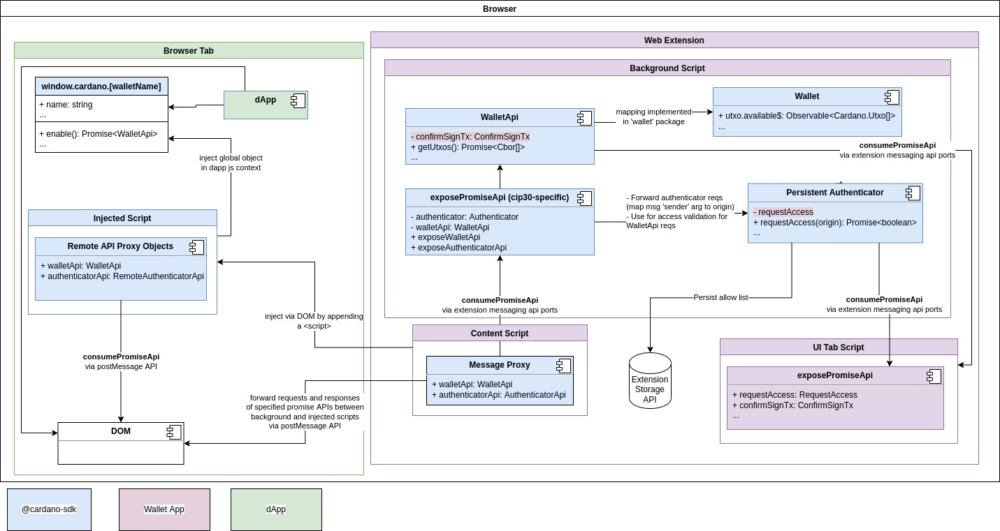

# Cardano JS SDK | CIP30
This package implements concepts from the draft specification being developed in [CIP-0030]. The 
package defines TypeScript types and interfaces, as well as utilities to implement allow list 
persistence and set up web extension messaging.

See [example web extension]. Overview of how it works:

[example web extension]: ../web-extension/e2e/extension
[CIP-0030]: https://github.com/cardano-foundation/CIPs/pull/88
