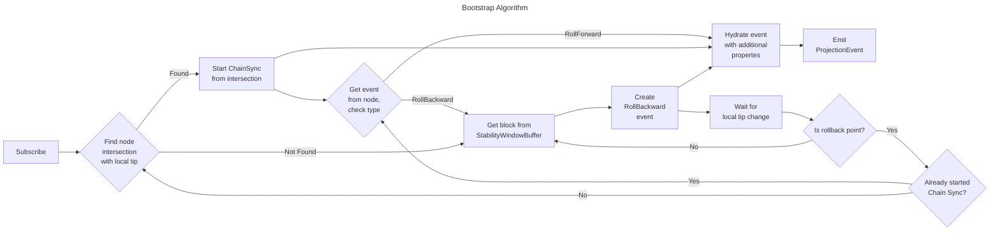

# Cardano JS SDK | projection

This package is a library of generic projection types and utilities.

> [!TIP]
> [Guide to Projections and Read Models in Event-Driven Architecture](https://event-driven.io/en/projections_and_read_models_in_event_driven_architecture/)

If you're interested in projecting into PostgreSQL database, see [projection-typeorm](../projection-typeorm) package.

If you're interested in projector application as run by Lace, see [setup](../cardano-services/src/Projection) and [README](../cardano-services/README.md) in `cardano-services` package.

## Prerequisites

In order to understand how `cardano-js-sdk` projections work, you'll first need basic understanding of:

- [Observables](https://github.com/tc39/proposal-observable) (we're using [RxJS](https://rxjs.dev/) implementation)
- Chain Sync mini protocol (well explained in [Ogmios docs](https://ogmios.dev/mini-protocols/local-chain-sync/))

## Types

### ProjectionEvent\<ExtraProps>

All projections start by obtaining a source/producer<sup>1</sup>, which is an `Observable<ProjectionEvent<{}>>`. These events are very similar to Chain Sync events, but there are some important differences:

1. Block format is compatible with types from `@cardano-sdk/core` package.
2. Events include some additional properties: `{eraSumaries, genesisParameters, epochNo, crossEpochBoundary}`.
3. `RollBackward` events include block data (instead of just specifying the rollback point), and are emitted once for **each** rolled back block.

#### ExtraProps (Generic Parameter)

Source observable can be piped through a series of RxJS operators, which may add some properties to the event. In a nutshell, `ProjectionEvent<T> = ProjectionEvent<{}> & T`. For more detail see [Mappers](#mappers).

### StabilityWindowBuffer

Since `ProjectionEvent{eventType=RollBackward}` includes block data, we must store some number (at least `k`, which is the "security parameter") of latest blocks so that if a fork/rollback happens, we can call `StabilityWindowBuffer.getBlock(hash)` in order to build a valid `ProjectionEvent`.

### ObservableCardanoNode

This is our interface to Chain Sync and Local State Query protocols of Cardano node. The only implementation available in `cardano-js-sdk` is `OgmiosObservableCardanoNode`.

## Utilities

### Bootstrap.fromCardanoNode

Creates a projection source (`Observable<ProjectionEvent>`) from:

- [ObservableCardanoNode](#observablecardanonode)
- [StabilityWindowBuffer](#stabilitywindowbuffer)
- `Observable<TipOrOrigin>` that emits block header of last processed event (local tip). This is used to find intersection point.



### Mappers

Projections are typically

1. Interpreting the block (e.g. extracting some relevant properties from all transactions). `Mappers` is a namespace that contains a collection of RxJS operators that process the ProjectionEvent (block) and emit a new event object that has some additional properties.
2. Doing something with it (e.g. store into the database).

Here's an example:

```typescript
// source$: Observable<ProjectionEvent<{}>>
source$.pipe(
  // policyId is a parameter that should be provided
  // by handle issuer, e.g. ADA Handle
  Mappers.withHandles({ policyId }),
  // type WithHandles = { handles: HandleOwnership; }
  // Event type can also be inferred (no need for explicit type declaration)
  tap((event: ProjectionEvent<WithHandles>) => {
    console.log('Handles found by withHandles operator', event.handles);
  })
);
```

### Other Utils

#### InMemoryStabilityWindowBuffer

If your application doesn't need persistence, you can use in-memory implementation of [StabilityWindowBuffer](#stabilitywindowbuffer), which can also be used as local tip tracker for Bootstrap (provides `Observable<TipOrOrigin>`).

---

_<sup>1</sup>Currently our projection source observable is not a pure 'Producer', as events have a `requestNext` method that is used to control the source. This is subject to change in the future._
